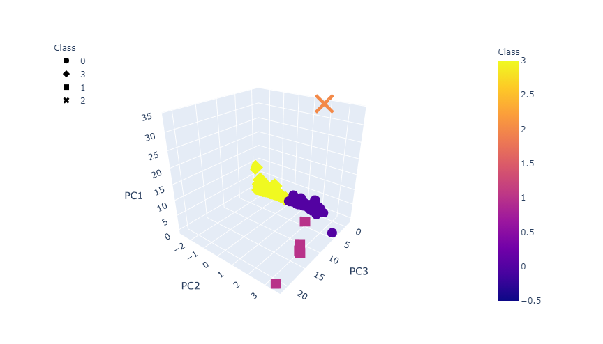

# Cryptocurrencies

## Overview of Analysis:
The purpose of the CryptoCurrency Challenge is to create an analysis to prepare clients into getting into the cryptocurrency market. This was completed using Principal Component Analysis to break the data into 3 principal components and plot them on a 3D graph. We are then giving an easy to interpret graph that reduced the dimenionality of the dataset. This was completed by using Pandas to code on Jupyter Notebook and sklearn to analyze the data and hvplot to graph the datasets. 

## Results

Of the 532 tradable cryptocurrencies, and using an elbow graph to find the best value for k, we determined that 4 clusters was the best fit for this dataset. The model was then initialized to fit the 3 principal components into 4 clusters and graphed as below.

### Summary of PCA-data and Clusters using 3D Scatter Graph

